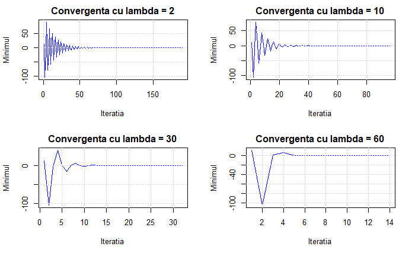
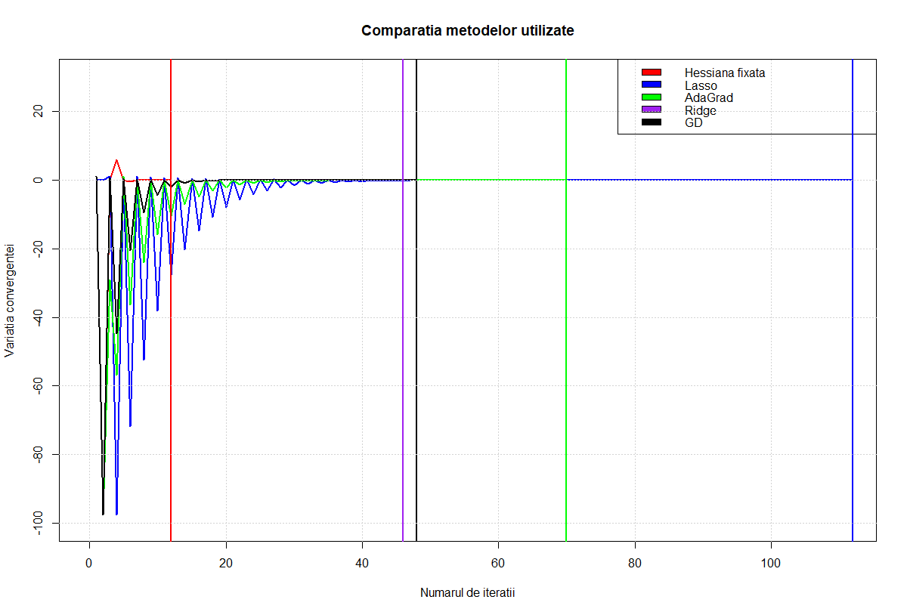

```{r setup, include=FALSE}
knitr::opts_chunk$set(echo = TRUE)
```

# Preliminarii

Regresia liniară este un model cu origini în statistică, ce ne ajută sa determinăm dependența existentă între datele de intrare și o valoare de ieșire. Așa cum îi spune și numele, **regresia** modelează predicții pe date continue, aplicațiile fiind diverse și din toate domeniile: putem determina numărul (în aproximația ordinului de mărime) de celule afectate în organismul uman pe baza unui set de analize medicale, putem prezice câte vizualizări are un video încărcat pe YouTube în funcție de numărul de comentarii, putem prezice prețul unei case pe baza specificațiilor acesteia, iar exemplele pot continua. 

Utilizând literatura de specialitate, având un **dataset** *X* (care conține **feature vectori** $x_i \in X$), putem prezice un **output** *y*, astfel încât $\forall x_i \in X \ \exists y_i \in y$. Cum datele sunt matriceale, avem egalitate între dimensiunea lui *y* și numărul de linii din *X*. (toți vectorii sunt vectori **coloană**)

Cu toate că prima impresie este aceea că modelul este relativ unul simplu, necesitând doar a găsi o cea mai bună potrivire a unei funcții (numită **funcție de ipoteză**) care, aplicată pe *X*, să aproximeze cel mai bine *y*, există diferite probleme care apar, plecând și de la modul de reprezentare a datelor de intrare și la ordinul de mărime al acestora. În fapt, determinarea funcției de cost nu este decât un pas în tot procedeul de antrenare, amintind aici prelucrarea și normalizarea datelor, alegerea modelului, antrenarea efectivă a modelului și evaluarea acestuia. În cadrul acestui proiect, ne focusăm pe antrenarea efectivă (descrierea matematică și alegerea algoritmilor potriviți), dar nu putem ignora niciunul dintre ceilalți pași (pentru a ști că am procedat corect, avem nevoie de date - date care trebuie să fie *corecte*; ulterior, trebuie să *testăm* modelul, pentru a cuantifica eroarea între ce am obținut și *ce trebuia obținut*). În cazul alegerii algoritmului, trebuie să testăm care este cea mai bună opțiune pe datele pe care vrem să lucrăm: în principal, vrem să rezolvăm o problemă de optimizare, i.e. avem nevoie de o funcție nu doar diferențiabilă ci, eventual, convexă (pentru a exista un unic minim). În acest sens, există două formulări suplimentare ale problemei în cazul regresiei, care ne ajută ca funcția să nu fie **doar** convexă, ci și **tare convexă** (prin adăugarea unui **factor de regularizare**), obținând două forme: *Ridge* și *Lasso*.

# Regresia liniară

Regresia liniară dependentă de o singură variabilă *x* este cunoscută și sub numele de **regresie liniară univariată** sau **regresie liniară simplă**. Acest model este utilizat pentru o predicție 1 la 1 - pentru o singură intrare se prezice, în urma aplicării modelului, o singură ieșire. Regresia, ca model matematic în învățarea automată face parte din categoria învățării supervizate, ceea ce înseamnă că datele sunt etichetate, adică valorile de ieșire sunt cunoscute în momentul antrenării. 

## Funcția de ipoteză

Regresia liniară dependentă de mai multe variabile *x* este cunoscută și sub numele de **regresie liniară multivariată** sau **regresie liniară multiplă**. Funcția de ipoteză a modelului se va scrie sub următoarea formă:

$$h_w(x) = w_0 + w_1x_1 + ... + w_nx_n + \varepsilon = \sum_{j=0}^{n}w_jx_j + \varepsilon$$

Observăm că funcția de ipoteză este dată de combinația liniară dintre vectorul de intrare *x* și vectorul de ponderi *w*, ambii având dimensiune *n+1* (i.e. $x, w \in \mathbf{R}^{n+1}$). Cunoscând că $x_0 = 1$ (pentru a obține $w_0x_0 = w_0$), atunci putem reprezenta matriceal relația anterioară:

$$h_w(x) = w^Tx + \varepsilon$$

## Funcția de cost

Funcția de cost apare natural în urma descrierilor matematice anterioare: cunoaștem **targetul** pe care vrem să îl atingem pentru fiecare dată de intrare și cunoaștem **modelul matematic** efectiv pe care îl aplicăm (combinația liniară între un **feature vector** și **ponderi**, căreia i se adaugă un **bias**). Problema se pune asupra determinării celui mai bun **vectori de ponderi** în situația dată, i.e. căutăm $w \in \mathbf{R}^{n+1}$ astfel încât $h_w(x)$ să se apropie cât mai mult posibil de outputul real. În acest context, trebuie să definim un **cost**, i.e. o măsură care să ne ajute să cuantificăm eroarea existentă în alegerea lui *w* la un anumit pas al antrenării. 

Există mai multe metrici pe care le putem utiliza, dintre care amintim **MAE** (mean absolute error) și **RSS** (residual sum o squares) cu definițiile următoare:

$$MAE(w) = \frac{1}{n} \sum_{j=0}^{n+1} |y_i - h_w(x_i)|$$
$$RSS(w) = \sum_{i=0}^{n} (y_i - h_w(x_i))^2$$

unde $x_i$ este un **feature vector** de pe linia *i*, iar $y_i$ este **outputul** asociat. 

Considerând o funcție de cost în perspectiva determinării **vectorului de ponderi** prin metode de optimizare, alegem **RSS**, deoarece **MAE** nu este o **funcție diferențiabilă**. Pentru a simplifica modul de calcul în diferențierea în raport cu vectorul de ponderi, vom considera măsura **RSS** ca fiind definită astfel:

$$RSS(w) = \frac{1}{2m} \sum_{i=1}^{m}(y_i - h_w(x_i))^2$$

Scrierea este o **formă pătratică**, având echivalența matriceală: 

$$RSS(w) = (y - Hw)^T(y - Hw)$$

# Regresia liniară în abordarea celor mai mici pătrate

Această abordare ne cere, de fapt, să minimizăm funcția **RSS** în raport cu vectorul *w* (în limbaj natural, să găsim un *cel mai bun w*, adică acel *w* pentru care costul este minim). Ca problemă de optimizare, spunem că vom căuta $w^*$ care se exprimă astfel:

$$w^* = \arg \min_{w \in \mathbf{R}^{n+1}} {RSS(w)} = \arg \min_{w \in \mathbf{R}^{n+1}} \bigg{[} \frac{1}{2m} \sum_{i=1}^{m}(y_i - h_w(x_i))^2 \bigg{]}$$

Considerând cazul bidimensional, avem că $\hat{y}=\hat{w_0}+\hat{w_1}x_i$, deci eroarea va fi $e_i = y_i - \hat{y_i}$. Atunci:

$$
\begin{aligned}
RSS &= e_1^2 + e_2^2 + ... + e_m^2 \\ 
    &= (y_1 - \hat{w_0} - \hat{w_1}x_1^2)^2 + ... + (y_n - \hat{w_0} - \hat{w_1}x_m)^2 \\ 
    &= \sum_{i = 1}^{m}(y_i - \hat{w_0} - \hat{w_1}x_i)^2
\end{aligned}$$

În acest caz, a determina vectorul de feature-uri înseamnă a minimiza **RSS** în raport cu $w_0$ și $w_1$. Conform relației de mai sus, avem:

$$
\begin{aligned}
\nabla_{w_0}RSS(w) &= \frac{\partial RSS(w)}{\partial w_0} \\ 
                   &= \frac{\partial}{\partial w_0} \bigg{[} \sum_{i = 1}^{m}(y_i - \hat{w_0} - \hat{w_1}x_i)^2 \bigg{]} \\
                   &= \sum_{i = 1}^{m} \bigg{[} \frac{\partial}{\partial w_0} (y_i - \hat{w_0} - \hat{w_1}x_i)^2 \bigg{]} \\
                   &= -2 \sum_{i = 1}^{m} (y_i - \hat{w_0} - \hat{w_1}x_i) 
\end{aligned}
$$

Analog,

$$
\begin{aligned}
\nabla_{w_1}RSS(w) &= \frac{\partial RSS(w)}{\partial w_1} \\ 
                   &= \frac{\partial}{\partial w_1} \bigg{[} \sum_{i = 1}^{m}(y_i - \hat{w_0} - \hat{w_1}x_i)^2 \bigg{]} \\
                   &= \sum_{i = 1}^{m} \bigg{[} \frac{\partial}{\partial w_1} (y_i - \hat{w_0} - \hat{w_1}x_i)^2 \bigg{]} \\
                   &= -2 \sum_{i = 1}^{m} x_i(y_i - \hat{w_0} - \hat{w_1}x_i)
\end{aligned}
$$

Tot ce rămâne e făcut este să egalăm cu *0* cele două rezultate obținute (minimizăm **RSS** este echivalent cu minimizăm **RSS** pe fiecare dimensiune, adică egalăm cu *0*):

$$
\begin{aligned}
-2 \sum_{i = 1}^{m} (y_i - \hat{w_0} - \hat{w_1}x_i) = 0 &\Longleftrightarrow \sum_{i = 1}^{m} (y_i - \hat{w_0} - \hat{w_1}x_i) = 0 \\
  &\Longleftrightarrow (y_1 - w_0 - w_1x_1) + (y_2 - w_0 - w_1x_2) + ... + (y_m - w_0 - w_1x_m) = 0 \\
  &\Longleftrightarrow -mw_0 + \sum_{y=1}^{m}y_i - w_1\sum_{i=1}^{m} x_i = 0 \\
  &\Longleftrightarrow w_0 = \frac{1}{m} \sum_{i=1}^{m}y_i - w_1 \frac{1}{m} \sum_{i=1}^{m}x_i \\
  &\Longleftrightarrow w_0 = \bar{y} - w_1 \cdot \bar{x}
\end{aligned}
$$

Procedăm analog și pentru calculul lui $w_1$, având valoarea lui $w_0$ deja calculată ($w_0$ depinde de $w_1$, iar prin substituție în relațiile de mai jos, vom obține o formă a lui $w_1$ independentă de necunoscute):

$$
\begin{aligned}
-2 \sum_{i = 1}^{m} x_i(y_i - \hat{w_0} - \hat{w_1}x_i) = 0 &\Longleftrightarrow \sum_{i = 1}^{m} x_i(y_i - \hat{w_0} - \hat{w_1}x_i) = 0 \\
  &\Longleftrightarrow x_1(y_1 - w_0 - w_1x_1) + x_2(y_2 - w_0 - w_1x_2) + ... + x_m(y_m - w_0 - w_1x_m) = 0 \\
  &\Longleftrightarrow \sum_{i=1}^{m}x_iy_i - w_0 \sum_{i=1}^{m} x_i - w_1 \sum_{i=1}^{m} x_i^2 = 0 \\
  &\Longleftrightarrow \sum_{i=1}^{m}x_iy_i - \bar{y}\sum_{i=1}^{m} x_i + w_1 \bar{x} \sum_{i=1}^{m} x_i - w_1 \sum_{i=1}^{m} x_i^2 = 0 \\
  &\Longleftrightarrow \sum_{i=1}^{m}x_iy_i - \bar{y}\sum_{i=1}^{m} x_i + \bigg{(} \bar{x} \sum_{i=1}^{m} x_i - \sum_{i=1}^{m} x_i^2 \bigg{)} w_1 = 0 \\
  &\Longleftrightarrow w_1 = \frac{\bar{y}\sum_{i=1}^{m} x_i - \sum_{i=1}^{m}x_iy_i}{\bar{x} \sum_{i=1}^{m} x_i - \sum_{i=1}^{m} x_i^2} 
\end{aligned}
$$
Cu forma finală:

$$w_1 = \frac{\sum_{i=1}^{m}y_ix_i - \frac{\sum_{i=1}^{m}y_i \sum_{i=1}^{m}x_i}{m}}{\sum_{i=1}^{m}x_i^2 - \frac{\big{(} \sum_{i=1}^{m} x_i \big{)}^2}{m}}$$

Pentru a simplifica implementarea, cele două ecuații anterioare pot fi scrise matriceal sub următoarea formă, care ne asigură și generalizarea metodei **celor mai mici pătrate**:

$$w = (X^T X)^{-1}X^T Y$$

Fie următoarea implementare:

```{r, eval=TRUE}
# alegem un interval de date pe care simulam regresia
x = seq(-2, 2, 0.02)
# alegem un output aleator, dar liniar dependent de x
y = runif(length(x), -1, 1) + runif(length(x), 0, 1.5) * x

# ii adaugam o coloana de 1 (pentru a ii mari dimensiunea fara a afecta calculul)
X = cbind(1, x)

# aplicam metoda celor mai mici patrate
OLS_coef <- solve(t(X) %*% X) %*% t(X) %*% y

# Definim urmatoarea functie, pentru a obtine curba de regresie
regression_line <- function(x, w0, w1) 
{
  return(w0 + x*w1)
}

line = regression_line(x, OLS_coef[1], OLS_coef[2])

# Plotam datele
plot(x, y, col="blue", cex=0.7, 
     main="Regresie liniară pe date simulate",
     xlab="Input",
     ylab="Output")

lines(x, line, col="red", lwd=2)
grid()
legend("topleft", "Legenda", 
       c("Date generate", "Curba de regresie"), 
       fill=c("blue", "red"))
```

# Regresia liniară ca probabilitate maximă

Putem interpreta regresia liniară ca fiind probabilitatea să obținem un **output** *y*, știind **inputul** x, adică $p(y | x)$. Această măsură se definește ca o distribuție normală:

$$p(y | x) = \mathcal{N}\big{(}y | \hat{y}(x, w), \sigma^2\big{)}$$

unde funcția $\hat{y}(x, w)$ prezice media distribuției gaussiene. Putem scrie probabilitatea ecuației $RSS(w) = \sum_{i=1}^{m} (y_i - \hat{w_0} - \hat{w_1}x_i)^2$ ca un produs de probabilități:

$$
\begin{aligned}
\mathcal{L}\big{(}p(y | x)\big{)} 
  &= \prod_{i=1}^{m} \sqrt{2 \pi \sigma^2} \exp \big{(}-\frac{1}{2} \frac{(y_i - wx_i)^2}{\sigma^2} \big{)} \\
  &=(2 \pi \sigma^2)^{\frac{m}{2}} \cdot \exp \big{(} -\frac{1}{2\sigma^2} \sum_{i=1}^{m} (y_i - wx_i)^2 \big{)}
\end{aligned}$$

Logaritmând relația de mai sus, obținem măsura **log-likelihood** (logaritmul probabilității):

$$
\begin{aligned}
ll\big{(} p(y | x) \big{)} 
  &= \log \bigg{(} (2 \pi \sigma^2)^{\frac{m}{2}} \cdot \exp \big{(} -\frac{1}{2\sigma^2} \sum_{i=1}^{m} (y_i - wx_i)^2 \big{)} \bigg{)}
\end{aligned}
$$

Avem:

$$\sum_{i=1}^{m} \log p(y_i | x_i; w) = -m \log \sigma - \frac{m}{2} \log (2\pi) - \sum_{i=1}^{m} \frac{||\hat{y_i} - y_i||^2}{2 \sigma^2}$$

Cum cele două mărimi ($m \log \sigma$ și $\frac{m}{2} \log (2\pi)$) nu depind nici de input, nici de vectorul de ponderi, înseamnă că **maximizarea** sumei din membrul stând este echivalentă cu **minimizarea** sumei din membrul drept, astfel că definim măsura **MSE** (mean squared error):

$$MSE(w) = \frac{1}{m} \sum_{i=1}^{m} ||\hat{y_i} - y_i||^2$$

(funcția depinde de *w* deoarece $\hat{y_i}$ este o funcție de *w*). 

Pentru a putea rezolva probleme de minimizare, vom utiliza **tehnici de optimizare**, aplicând algoritmi specifici. Avem grijă la două aspecte: funcțiile pe care le utilizăm, numite **funcții obiectiv** în literatura de specialitate trebuie să fie **diferențiabile**. Pentru a ne asigura de existența unui minim global, vom utiliza, în plus, funcții **convexe**.

# Metoda Gradient Descent

Amintim problema de optimizare pe care am propus-o la un pas anterior, și anume:

$$w^* = \arg \min_{w \in \mathbf{R}^{n+1}} {RSS(w)} = \arg \min_{w \in \mathbf{R}^{n+1}} \bigg{[} \frac{1}{2m} \sum_{i=1}^{m}(y_i - h_w(x_i))^2 \bigg{]}$$

Pasul de actualizare în **metoda gradient** va fi dat de următoarea formulă (actualizarea la un pas se aplică pe vectorul de ponderi, cel căutat):

$$w_{j+1} = w_j - \eta \cdot \nabla_{w_j} RSS(w_j)$$

Calculăm, astfel, $\nabla_{w_j} RSS(w_j)$ (unde $h_w(x_i) = w^T x_i$: 

$$
\begin{aligned}
\nabla_{w} RSS(w) 
  &= \frac{\partial}{\partial w} \bigg{[} \frac{1}{2m} \sum_{i=1}^{m}(y_i - w^Tx_i)^2\bigg{]} \\
  &= \frac{1}{2m} \sum_{i=1}^{m} \bigg{[} \frac{\partial}{\partial w} (y_i - w^Tx_i)^2 \bigg{]} \\
  &= \frac{1}{2m} \sum_{i=1}^{m} -2 (y_i - w^Tx_i)x_i \\
  &= -\frac{1}{m} \sum_{i=1}^{m} (y_i - w^Tx_i)x_i \\
  &= -2H^T(y-Hw)
\end{aligned}
$$

Înlocuind această formulă în ecuația de actualizare din Gradient Descent, obținem:

$$w_{j+1} = w_j - \eta \cdot \big{(} -2H^T(y-Hw) \big{)} = w_j + 2\eta H^T(y-Hw)$$

Avem următoarea implementare pentru **metoda gradient**:

```{r, eval=TRUE}
# alegem un interval de date pe care simulam regresia
x = seq(-2, 2, 0.02)
# alegem un output aleator, dar liniar dependent de x
y = runif(length(x), -1, 1) + runif(length(x), 0, 1.5) * x
X = cbind(1, x)

# Plotam datele
plot(x, y, col="blue", cex=0.7, 
     main="Regresie liniara cu Gradient Descent",
     xlab="Input",
     ylab="Output")

# alegem un vector aleator de ponderi
w = runif(dim(X)[2])

# alegem eta = rata de invatare si eps = ordinul de eroare
eta = 0.001
eps = 1e-5

# aplicam metoda gradient
while(TRUE)
{
  # plotam curbele initiale de regresie
  # la primul pas, observam alegerea pur arbitrara
  lines(x, regression_line(x, w[1], w[2]), lty=2)
  wn = w + 2 * eta * t(X) %*% (y - X %*% w)
  if (abs(norm(wn - w, "2")) < eps)
  {
    break;
  }
  w = wn
}

# plotam curba finala de regresie
lines(x, regression_line(x, w[1], w[2]), col="red", lwd=2)
grid()
legend("topleft", "Legenda", 
       c("Date generate", "Curba de regresie"), 
       fill=c("blue", "red"))

```

Pentru a vedea numărul de iterații și viteza de descreștere, alegem varianta în care plotăm dependența dintre valoarea funcției **RSS** și indexul iterației curente. Pentru aceasta, modificăm codul de mai sus astfel:

```{r, eval=TRUE}
y = runif(length(x), -1, 1) + runif(length(x), 0, 1.5) * x
X = cbind(1, x)
w = runif(dim(X)[2])

eta = 0.001
eps = 1e-5

minimum = c()
while(TRUE)
{
  # calculam RSS(w)
  local_min = -1/dim(X)[2] * t(X) %*% (y - X %*% w)
  minimum = c(minimum, local_min)
  wn = w + 2 * eta * t(X) %*% (y - X %*% w)
  if (abs(norm(wn - w, "2")) < eps)
  {
    break;
  }
  w = wn
}

plot(minimum, type="l", lwd=2, col="red",
     xlab="Numarul de iteratii",
     ylab="Minim curent")
grid()
legend("topright", "Legenda", 
       c("Descresterea spre minim"), 
       fill=c("red"))
```

Metoda **Gradient** poate fi rezolvată și fără o abordare iterativă, egalând derivata pe direcția *w* a funcției **RSS** cu *0*. Rezultatul pe care îl obținem este cel pe care l-am implementat ca generalizare pentru cele mai mici pătrate, i.e. $\frac{\partial}{\partial w}RSS(w) = -2H^T(y-Hw)=0 \Rightarrow w = (H^TH)^{-1}H^T y$.

Observăm că, în metoda iterativă, am ales ca un criteriu de oprire când norma $||w_{j+1} - w_j||_2 < \varepsilon$, dar există diferite alte condiții de oprire, de exemplu când norma $\big{|}\big{|} \frac{\partial}{\partial w} RSS(w_j) \big{|}\big{|} < \varepsilon$, formula de calcul fiind: 

$$\bigg{|}\bigg{|} \frac{\partial}{\partial w} RSS(w^{(t)}) \bigg{|}\bigg{|}_2 = \sqrt{\frac{\partial}{\partial w}RSS(w_0^{(t)})^2 + ... + \frac{\partial}{\partial w}RSS(w_m^{(t)})^2}$$

În acest caz, dacă implementăm, observăm că apropierea de minim se face astfel:

```{r, eval=TRUE}
x = seq(-2, 2, 0.02)
y = runif(length(x), -1, 1) + runif(length(x), 0, 1.5) * x
X = cbind(1, x)

w = runif(dim(X)[2])

# calculam primul RSS(w)
RSSw = -1/dim(X)[2] * t(X) %*% (y - X %*% w)
eta = 1e-3
eps = 1e-5

minimum = c(RSSw)

# modificam conditia de oprire
while(norm(RSSw, "2") > eps)
{
  wn = w + 2 * eta * t(X) %*% (y - X %*% w)
  w = wn
  RSSw = -1/dim(X)[2] * t(X) %*% (y - X %*% w)
  minimum = c(minimum, RSSw)
}

plot(minimum, type="l", lwd=2, col="red",
     xlab="Numarul de iteratii",
     ylab="Minim curent")
grid()
legend("topright", "Legenda", 
       c("Descresterea spre minim"), 
       fill=c("red"))
```

Comparăm cele două metode de oprire, aplicându-le pe același set de date. Conform observațiilor, condiția de oprire pe care am utilizat-o inițial pentru **metoda gradient** aplicată iterativ (i.e. cea în care am impus $||w_{j+1} - w_j||_2 < \varepsilon$) este mai rapidă (cu un pas în iterație):

```{r, eval=TRUE}
x = seq(-2, 2, 0.02)
y = runif(length(x), -1, 1) + runif(length(x), 0, 1.5) * x
X = cbind(1, x)

eta = 0.001
eps = 1e-4

# Prima conditie de oprire
w = runif(dim(X)[2])
w.copy = w
minimum = c()
while(TRUE)
{
  local_min = -1/dim(X)[2] * t(X) %*% (y - X %*% w)
  minimum = c(minimum, local_min)
  wn = w + 2 * eta * t(X) %*% (y - X %*% w)
  if (abs(norm(wn - w, "2")) < eps)
  {
    break;
  }
  w = wn
}

plot(minimum, type="l", lwd=2, col="red",
     xlab="Numarul de iteratii",
     ylab="Minim curent")

# A doua conditie de oprire
w = w.copy
RSSw = -1/dim(X)[2] * t(X) %*% (y - X %*% w)
minimum = c(RSSw)

while(norm(RSSw, "2") > eps)
{
  wn = w + 2 * eta * t(X) %*% (y - X %*% w)
  w = wn
  RSSw = -1/dim(X)[2] * t(X) %*% (y - X %*% w)
  minimum = c(minimum, RSSw)
}

lines(minimum, type="l", lty=2, lwd=2, col="green")
grid()
legend("topright", "Legenda", 
       c("Conditia cu norme iterative", "Conditia cu norma RSS"), 
       fill=c("red", "green"))
```

## Metoda Stochastic Gradient Descent

Pentru metoda *stochastic gradient descent* (SGD), algoritmul selectează o singură observație din setul de date și modifică vectorul de ponderi relativ la selecția făcută. Procesul se repetă și valorile vectorului de ponderi se modifică, până când valorile sunt corecte pentru întreg setul utilizat. Vom descrie matematic această operațiune, iar apoi vom compara SGD cu metoda standard (*batch gradient descent*).

Având o singură observație la fiecare pas, definim măsura $RSS_i(w)$, astfel:

$$RSS_i(w) := (y_i - x_i^Tw)^2$$

astfel că

$$\nabla^2 RSS_i(w) = \frac{\partial}{\partial w}RSS_i(w) = \frac{\partial}{\partial w} (y_i - x_i^Tw)^2 = -2(y_i-x_i^Tw)x_i$$

În acest caz, un pas de actualizare în metoda iterativă va avea următoarea formă:

$$w_{j+1} = w_j - 2 \eta \nabla^2 RSS_i(w_j) = w_j + 2 \eta (y_i - x_i^T w_j)x_i$$

Ca algoritm, vom avea următoarea abordare:

```{r, eval=FALSE, highlight=FALSE}
SGD(X, y, eps, eta, w)
  cat_timp nu converge
    pentru i = 1..n
      calculeaza w_j conform formula
    calculeaza norma RSSw
    daca norma RSSw < eps
      stop
  returneaza w
```

Implementarea în limbajul *R* este următoarea, pentru care am considerat importantă inclusiv modalitatea de descreștere spre minim și compararea curbei de regresie obținute cu metoda standard de calcul:

```{r, eval=TRUE}
x = seq(-2, 2, 0.01)
y = runif(length(x), 0, 1) + runif(length(x), 1, 1.5) * x
X = cbind(1, x)

plot(x, y, col="blue",
     main="SGD", cex=0.7,
     xlab="Input",
     ylab="Output")
grid()

# plotam OLS_coef pentru referinta
OLS_coef = solve(t(X) %*% X) %*% t(X) %*% y
lines(x, regression_line(x, OLS_coef[1], OLS_coef[2]),
     col="green", lwd=2)

w = rep(0, dim(X)[2])
eta = 1e-3
eps = 1e-2
n = as.integer(dim(X)[1] / 50)

minimum = c()

while(TRUE)
{
  for (i in 1:dim(X)[1])
  {
    X.local = X[i, ]
    y.local = y[i]
    wn <- w + 2/dim(X)[1] * eta * (y.local - X.local * w) * X.local
    w <- wn
  }
  
  RSSw <- -1/dim(X)[2] * t(X) %*% (y - X %*% w)
  minimum <- c(minimum, RSSw)
  
  if (abs(norm(RSSw, "2")) < eps)
  {
    break;
  }
}

line <- regression_line(x, w[1], w[2])

lines(x, line, col="red", lwd=2, lty=2)
legend("topleft", "Legenda",
       c("Coeficientii OLS", "Curba de regresie SGD"),
       fill=c("green", "red"))
```

Pentru a vedea descreșterea, plotăm lista **minimum**:

```{r, eval=TRUE}
plot(minimum, type="l", col="blue",
     main="Convergența",
     xlab="Iteratia",
     ylab="Minimul")
grid()
```

## SGD în varianta AdaGrad

Metoda **gradientului stochastic descrescător** cunoaște diferite îmbunătățiri pentru grăbirea vitezei de convergență, una dintre ele fiind **AdaGrad** (algoritm publicat, pentru prima dată, în 2011); el se adaptează foarte bine pe date „rare” („împrăștiate”) și este adesea utilizat în ramuri ale învățării automate precum *procesarea limbajului natural* și *recunoașterea imaginilor*. Pentru demonstrație, însă, îl vom utiliza pentru a antrena modelul de regresie liniară considerat. Numărul de iterații pe care îl efectuează este vizibil mai mic decât cel obținut în urma aplicării metodei stochastice neprelucrate. 

În cele ce urmează, prezentăm formula de actualizare a vectorului de ponderi, *w* (adunarea lui $\varepsilon$ la numitor este o siguranță asupra faptului că nu vom împărți la *0*):

$$w_{j+1} = w_j - \eta \cdot \frac{1}{\sqrt{G_{j,j}} + \varepsilon}\nabla_{w_j}RSS_i(w_j)$$

Exact ca la metoda stochastică, reprezentarea $RSS_i(w_j)$ este utilizată pentru a preciza că actualizăm o singură observație la un anumit pas, și nu toate observațiile din setul inițial de ipoteze. Mărimea $G_{j, j}$ se definește ca fiind o matrice diagonală, unde elementele diagonale sunt calculate astfel:

$$G_{j, j} := \sum_{\tau=1}^{t} \nabla_w RSS_{\tau, j}^2(w)$$

ceea ce se va implementa, de fapt, ca o relație iterativă, adică fiecare măsură nouă $G_{j+1, j+1}$ va avea recurența dată de:

$$G_{j+1, j+1} = G_{j, j} + \nabla_w RSS_j^2(w)$$

Implementarea va fi:

```{r, eval=TRUE}
x = seq(-2, 2, 0.02)
y = runif(length(x), -1, 1) + runif(length(x), 0, 1.5) * x
X = cbind(1, x)

eta = 0.1 # ii setam un learning rate
          # dar il regularizeaza si el prin relatia iterativa
eps = 1e-4

w = rep(0, dim(X)[2])

minimum = c()
g = 0 # suma gradientilor patratici
while(TRUE)
{
  # gi este gradientul pe iteratia curenta
  gi <- -1/dim(X)[2] * t(X) %*% (y - X %*% w)
  # folosim minimum la plotare, sa vedem convergenta spre 0
  minimum = c(minimum, gi)
  g <- g + gi^2
  
  # relatia de update
  wn <- w - eta * gi / (sqrt(g) + eps)
  
  if (norm(gi, "2") < eps)
  {
    break;
  }
  
  w <- wn
}
```

Plotăm următoarele două grafice, curba de regresie în AdaGrad și convergența:

```{r, eval=TRUE}
plot(x, y, col="blue",
     main="Curba de regresie AdaGrad", cex=0.7,
     xlab="Input",
     ylab="Output")
grid()
line <- regression_line(x, w[1], w[2])
lines(x, line, lwd=2, col="red")
```

```{r, eval=TRUE}
plot(minimum, type="l", col="blue",
     main="Convergenta",
     xlab="Iteratia",
     ylab="Minimul")
grid()
```

## Metode Newton

O altă abordare pentru rezolvarea **problemei de optimizare** ce apare în mod natural în minimizarea **funcției de cost** este cea în care utilizăm și informații de ordinul al doilea pentru **metoda iterativă de descreștere**. Dacă metodele **gradient** au utilizat doar o informație de ordinul I (și anume gradientul funcției), **metodele Newton** lucrează, în plus, și cu **hessiana**. Acest lucru favorizează îmbunătățirea vitezei de convergență în raport cu **numărul de iterații** (și este foarte importantă această precizare), dar trebuie să luăm în calcul faptul că o iterație va fi, de această dată, mai costisitoare (a calcula și o *hessiană* este mai lent computațional decât a calcula doar *gradientul*). 

Relația iterativă a **metodei Newton** este următoarea:

$$w_{j+1} = w_{j} - \eta \big{(}\nabla^2_w RSS(w)\big{)}^{-1} \cdot \nabla_w RSS(w)$$
O variantă mai rapidă, însă, este cea a **metodei Newton cu Hessiana fixată**, avantajul fiind evident: având o formulă fixă pentru **hessiană** la fiecare pas, viteza de calcul crește semnificativ. Formula de actualizare este, în acest caz:

$$w_{j+1} = w_j - \hat{H}^{-1} \cdot \nabla_w RSS(w)$$
unde 

$$\hat{H} := -\frac{1}{4} X X^T - \lambda I$$
Coeficientul $\lambda$ se alege pozitiv, iar rolul său este de a asigura *existența inversei hessianei*. Putem observa în implementare că $\lambda$ dictează inclusv viteza de descreștere. Fie următorul cod demonstrativ:

```{r, eval=TRUE}
x = seq(-2, 2, 0.02)
y = runif(length(x), -1, 1) + runif(length(x), 0, 1.5) * x
X = cbind(1, x)

eta = 0.1
eps = 1e-4
lambda = 2

w = rep(0, dim(X)[2])
minimum = c()

H <- -1/4 * t(X) %*% X - lambda * diag(dim(X)[2])
while(TRUE)
{
  gi <- -1/dim(X)[2] * t(X) %*% (y - X %*% w)
  minimum = c(minimum, gi)
  
  wn <- w + solve(H) %*% gi
  
  if (norm(gi, "2") < eps)
  {
    break;
  }
  
  w <- wn
}
```

Afișăm următoarele două grafice, exact ca până acum:

```{r, eval=TRUE}
plot(x, y, col="blue",
     main="Newton cu Hessiana fixata", cex=0.7,
     xlab="Input",
     ylab="Output")
grid()
line <- regression_line(x, w[1], w[2])
lines(x, line, lwd=2, col="red")
```

```{r, eval=TRUE}
plot(minimum, type="l", col="blue",
     main="Descresterea spre minim",
     xlab="Iteratia",
     ylab="Minimul")
grid()
```

Dacă analizăm diferite valori ale lui $\lambda$, observăm că o dată cu creșterea acestui parametru, viteza de convergență crește, de asemenea, obținând un minim satisfăcător de 12 iterații.


\newpage

# Metoda Ridge Regression

Metoda *ridge regression* se obține prin adăugarea unui nou termen în descrierea funcției de cost, acesta purtând denumirea de *factor de regularizare*. În cazul regresiei *Ridge*, regularizarea aplicată este $l_2$, definită prin $l_2(w) = \lambda \cdot ||w||_2^2$, unde $\lambda > 0$. Această formulare ne facilitează determinarea minimului din problema de optimizare, și vom demonstra, în cele ce urmează, că introducerea factorului de regularizare transformă funcția de cost *RSS* într-o funcție *tare convexă*.

Pentru început, studiem convexitatea funcției *RSS*, utilizând un criteriu de ordinul al II-lea, i.e. $RSS(w)$ convexă dacă și numai dacă $\forall w, \nabla^2 RSS(w) \geq 0$.

$$\frac{\partial}{\partial w}RSS(w) = -2X^T(y - Xw) \Rightarrow \nabla^2 RSS(w) = -2 \frac{\partial}{\partial w} X^T(y - Xw) = 2X^T X$$

Iar $2X^TX$ este o *formă pătratică*, deci este mereu pozitivă pentru orice alegere $w \in \mathbf{R}^n$. 

Fie următoarea variantă a funcției *RSS*, conform definiției *Ridge*:

$$RSS_R(w) = RSS(w) + \lambda \cdot ||w||_2^2 = RSS(w) + \lambda w^T w$$

Cum $\nabla^2 RSS(w) \geq 0$, iar $\nabla^2 [\lambda \cdot w^T w] = \lambda > 0$ (conform alegerii), avem atunci că 

$$\nabla^2 RSS_R(w) > 0, \forall w$$

ceea ce înseamnă că funcția $RSS_R$ este *tare convexă*, ceea ce ar trebui să conducă la determinarea în mai puțini pași a minimului. Vom studia aceasta prin implementarea algoritmului *gradient descent* cu formula de actualizare la fiecare pas dată de:

$$w_{j+1} = w_j + 2 \eta X^T(y - Xw) - 2 \eta \lambda w$$

Implementarea va fi următoarea (este făcută comparativ cu metoda *gradient descent* pentru regresia fără factor de regularizare):

```{r, eval=TRUE}
x = seq(-2, 2, 0.02)
y = runif(length(x), -1, 1) + runif(length(x), 0, 1.5) * x
X = cbind(1, x)

w = rep(0, dim(X)[2])

eta = 1e-3
eps = 1e-5

minimum_gds = c()
while(TRUE)
{
  # calculam RSS(w)
  RSSw = -1/dim(X)[2] * t(X) %*% (y - X %*% w)
  minimum_gds = c(minimum_gds, RSSw)
  wn <- w + 2 * eta * t(X) %*% (y - X %*% w)
  if (norm(RSSw, "2") < eps)
  {
    break;
  }
  w <- wn
}

w = rep(0, dim(X)[2])

minimum_gdr = c()
lambda = 10 # constanta numerica > 0
while(TRUE)
{
  # calculam RSS_R(w)
  RSSRw = -1/dim(X)[2] * t(X) %*% (y - X %*% w) + 1/dim(X)[2] * lambda * w
  minimum_gdr = c(minimum_gdr, RSSRw)
  wn <- w + 2 * eta * t(X) %*% (y - X %*% w) - 2 * eta * lambda * w
  if (norm(RSSRw, "2") < eps)
  {
    break;
  }
  w <- wn
}
```

Iar rezultatele sunt următoarele:

```{r, eval=TRUE}
print(length(minimum_gds)) # numarul de pasi pentru regresia standard
print(length(minimum_gdr)) # numarul de pasi pentru regresia Ridge
```

având următoarele plot-uri:

```{r, eval=TRUE}
plot(minimum_gds, type="l", lwd=2, col="red",
     main="Descrestere standard",
     xlab="Numarul de iteratii",
     ylab="Minim curent")
grid()
```

```{r, eval=TRUE}
plot(minimum_gdr, type="l", lwd=2, col="blue",
     main="Descrestere Ridge",
     xlab="Numarul de iteratii",
     ylab="Minim curent")
grid()
```

# Metoda Lasso Regression

Varianta regresiei de tip **lasso** este utilă atunci când avem seturi de date foarte mari, pentru care regresia de tip **ridge** ar pune probleme computaționale semnificative. Acțiunea exactă a algoritmului de învățare în cazul acesta (*lasso*) este aceea că parametrii mai puțin semnificativi / redundanți ajung să fie *0* și, prin urmare, să nu impacteze în rezultatul final.

Dacă în **regresia ridge** aveam regularizare $l_2$, în cazul **regresiei lasso** avem o regularizare cu norma vectorială *1*, definită astfel:

$$\forall w \in \mathbf{R}^n, ||w||_1 = \sum_{i=1}^{n} |w_i|$$

Problema de optimizare ajunge, astfel, în forma de a minimiza costul $RSS_L(w)$, exprimat ca

$$RSS_L(w) = RSS(w) + \lambda ||w||_1$$

O observație importantă este aceea că nu mai putem lucra cu algoritmi standard de optimizare, pentru că funcția $RSS_L(w)$ **nu este diferențiabilă** (pentru că funcția *modul* nu este diferențiabilă). Pe baza relației de mai sus, putem observa următoarele trei cazuri:

$$\lambda = 0 \Rightarrow \hat{w}^{Lasso} = \hat{w}^{OLS}$$
$$\lambda \to \infty \Rightarrow \hat{w}^{Lasso} = 0$$
$$0 < \lambda < \infty \Rightarrow 0 \leq \hat{w}^{Lasso} \leq \hat{w}^{OLS}$$

Implementarea acestui **model de regresie** se va face pe baza algoritmului **Coordinate Descent**, descris astfel:

    CoordinateDescent(X, y, w, lambda)

      initializeaza w
  
      cat timp nu converge

      calculeaza rho = X^T (y - Xw)

      pentru j in 0..n
      
        daca rho[j] < -lambda / 2 ************
        
          atunci w[j] <- rho[j] + lambda / 2
          
        altfel daca rho[j] apartine [-lambda / 2, lambda / 2] 
        
          atunci w[j] <- 0
          
        altfel w[j] <- rho[j] - lambda / 2
        
      returneaza w

Pentru implementare, vom considera și o măsura standard $\eta$ care să reprezinte **rata de învățare**, astfel că varianta codului în R este următoarea:

```{r, eval=TRUE}
x = seq(-2, 2, 0.02)
y = runif(length(x), -1, 1) + runif(length(x), 0, 1.5) * x
X = cbind(1, x)

eta = 1e-3

# de alegerea lui lambda depinde viteza de convergenta
# cu cat lambda e mai mic, cu atat converge mai rapid
lambda = 0.3
eps = 1e-5
w = rep(0, dim(X)[2])
rho = rep(0, dim(X)[2])

minimum = c()
while (TRUE)
{
  rho = rho + eta * t(X) %*% (y - X %*% w)
  wn = rep(0, dim(X)[2])
  
  for (j in 1:dim(X)[2])
  {
    if (rho[j] < -lambda / 2) wn[j] = rho[j] + lambda / 2
    else if (rho[j] <= lambda / 2) wn[j] = 0
    else wn[j] = rho[j] - lambda / 2
  }
  
  minimum = c(minimum, gi)
  gi <- -1/dim(X)[2] * t(X) %*% (y - X %*% w)
  
  if (norm(gi, "2") < eps)
  {
    break;
  }
  
  w = wn
}
```

Ploturile pentru **curba de regresie** și pentru **convergența metodei** sunt următoarele:

```{r, eval=TRUE}
plot(x, y, col="blue",
     main="Coordinate Descent", cex=0.7,
     xlab="Input",
     ylab="Output")
grid()
line <- regression_line(x, w[1], w[2])
lines(x, line, lwd=2, col="red")
```

```{r, eval=TRUE}
plot(minimum, type="l", col="blue",
     main="Convergenta",
     xlab="Iteratia",
     ylab="Minimul")
grid()
```

## Rezultate pentru toate tipurile de Regresie

Considerând, pentru fiecare algoritm în parte, setul de **hiperparametri** care conduce la minimizarea funcției cu viteza cea mai mare de convergență, obținem următorul grafic, în care putem observa apropierea de *0* (convergența), cât și numărul de iterații efectuate de fiecare algoritm. Așa cum era de așteptat, algoritmul implementat prin **metoda Newton** converge cel mai rapid *în număr de iterații*, pentru că utilizează *informații de ordinul al II-lea* (ceea ce nu înseamnă că este și mai rapid ca timp, un pas fiind mai costistior din punct de vedere computațional).



# Asumpții pentru Regresia Liniară

Pentru ca un algoritm de **regresie** să poată fi utilizat, el trebuie să respecte anumite condiții, ce vor fi prezentate în cele ce urmează. 

## Relația liniară între date

Între setul de observații primit, *X*, și ieșirile așteptate, *y* trebuie să existe o relație liniară. Acest lucru poate fi observat utilizând o metodă grafică: plotăm observațiile din setul de date, curba care se obține în urma antrenării modelului și curba valorilor reziduale. Dacă există un anume șablon în grafic, atunci relația dintre intrare și ieșire este neliniară. Această problemă poate fi rezolvată printr-un **feature polinomial**, ceea ce înseamnă că ceea ce concluzionăm este că relația nu este una liniară în *x*, ci în $x^n, n > 1$. 

## Media valorilor reziduală nulă

Vom utiliza o implementare în R pentru a arăta că, pentru un model liniar, media reziduală este 0 (aproximativ).

```{r, eval=TRUE}
x = seq(-2, 2, 0.02)
y = runif(length(x), -1, 1) + runif(length(x), 0, 1.5) * x
X = cbind(1, x)

fit = lm(X~y)
mean.residuals = mean(fit$residuals)
print(mean.residuals)
```

## Valorile reziduale sunt necorelate

Valorile reziduale $\varepsilon_1, \varepsilon_2, ..., \varepsilon_n$ sunt necorelate, iar acesta poate fi observată afișând rezultatul următor:

```{r, eval=FALSE}
(lmtest::dwtest(fit))$p.value
```

obținând 0.3654994.

## Dispersia constantă a reziduului

Cunoscută și ca **homoscedasticitatea reziduului**, este o asumpție care se referă la faptul că reziduurile au o aceeași varianță, adică sunt independente și uniform distribuite. Această proprietate poate fi vizualizată grafic, atunci când plotăm valorile reziduale avem că acestea nu tind să crească pe măsură ce valorile antrenate de model cresc.

## Absența colinearității pentru variabilele independente

**Colinearitatea** este întâlnită atunci când două sau mai multe variabile independente sunt legate una de alta. Testăm acest lucru prin calculul factorului variației de inflație (**VIF**), a cărui interpretare este că dacă **VIF** este cât mai mic (mai mic decât 2), atunci modelul este mai sigur a fi liniar. Formula de calcul este următoarea, în care $R^2$ este $R^2 = 1 - \frac{RSS}{TSS} = 1 - \frac{\sum_{i=1}^{n}(y_i - \hat{y_i})^2}{\sum_{i=1}^{n}(y_i - \bar{y})^2}$:

$$VIF = \frac{1}{1 - R^2}$$

# Un rezumat al rezultatelor modelelor de regresie

Definim noțiunile pentru **ipoteză nulă** și **ipoteză alternantă**, astfel că **ipoteza nulă**, $H_0$ este aceea în care toți coeficienții sunt egali cu *0*, adică nu este nicio relație între setul de observații și ieșirile așteptate, iar **ipoteza alternantă**, $H_a$, este aceea în care toți coeficienții sunt nenuli, adică există o relație între setul de observații și ieșirile așteptate.

Definim următoarele:

1. **t-value**: măsoară cât de mare este deviația standard între coeficientul determinat și valoarea *0*, considerând $H_0$ adevărată. Acesta se calculează prin împărțirea coeficientului estimat la deviația standard a erorii. O valoare mare pentru **t-value** înseamnă că ar trebui să considerăm feature-ul corespunzător în modelul nostru liniar ca având o șansă de a avea un coeficient nenul.

2. **p-value**: convertește **t-value** în probabilitate. Această probabilitate ne spune cât de mult poate fi un anumite coeficient egal cu zero în loc să aibă valoarea pe care am estimat-o în urma antrenării, i.e. determină care este probabilitatea ca **t-value** să fie mai mare ori mai mică decât cea pe care a estimat-o modelul nostru. 

3. **R-Squared** este $R^2$ calculat cu formula precizată anterior și are rolul de a măsura proporția varianței modelului: cu cât este mai aproape de 1, cu atât înseamnă că modelul este construit corect, pe când o valoare mai mică înseamna că alte feature-uri importante trebuie să fie incluse în model.

4. **R-Squared ajustat** previne utilizarea variabilelor redundante, având la bază aceeași formulă pentru $R^2$.

5. **AIC și BIC** (criteriile de informații **Akaike** și **Bayesiene**) sunt măsuri pentru determinarea corectitudinii antrenării. Ele penalizează modelele complexe, astfel încât un model cu un număr mic de parametri este de preferat în detrimentul unuia cu un număr mare de perametri. În general, dacă avem de ales între două modele antrenate, este bine să optăm spre cel cu scoruri mai mici pentru **AIC** și **BIC**.

# Extra: Regresia cu Feature Polinomial

Dacă avem o relație neliniară între setul de intrare *X* și vectorul de ieșire, *y*, atunci putem încerca sî facem un **fit polinomial**, după ce analizăm modul de dispunere al datelor. Pentru aceasta, vom defini următoarea matrice *X* de grad *degree*, obținută pe baza intrării *x*:

$$
X = \left[\begin{array}{ccccc} 
1 & x_1^1 & x_1^2 & ... & x_1^{degree}\\
1 & x_2^1 & x_2^2 & ... & x_2^{degree}\\
1 & x_3^1 & x_3^2 & ... & x_3^{degree}\\
\vdots & \vdots & \vdots & \ddots & \vdots\\
1 & x_n^1 & x_n^2 & ... & x_n^{degree}\\
\end{array}\right]
$$

Implementarea în R a acestei transformări este:

```{r, eval=TRUE}
polinomyal_matrix <- function(x, degree) 
{
  X = cbind(1, x)
  for (i in 2:degree)
  {
    X = cbind(X, x^i)
  }
  return(X)
}
```

Pentru demonstrație, vom considera următorul model cu antrenare și plotare:

```{r, eval=TRUE}
x = seq(-2, 2, 0.02)
y = runif(length(x), -1, 1) + runif(length(x), 0, 1.5) * x + runif(length(x), 2, 2.5) * x^2

X = polinomyal_matrix(x, 2)

w = solve(t(X) %*% X) %*% t(X) %*% y

plot(x, y, col="blue",
     main="Regresia cu feature polinomial", cex=0.7,
     xlab="Input",
     ylab="Output")
grid()

lines(x, w[1] + w[2] * x + w[3] * x^2, lwd=2, col="red")
```
